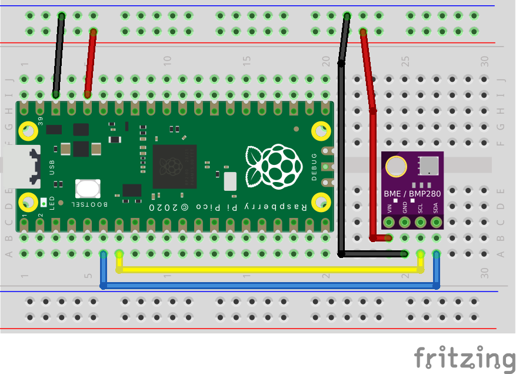

# RPi-Pico-BME280-cpp
Example repo to use the BME280 sensor over I2C with the Raspberry Pi Pico partly programmed with c++.

The BME280 is attached to GPIO 4 (SDA) and GPIO 5 (SCL) on the Raspberry Pi Pico.

Please Note: The source code does not have documentation yet.
